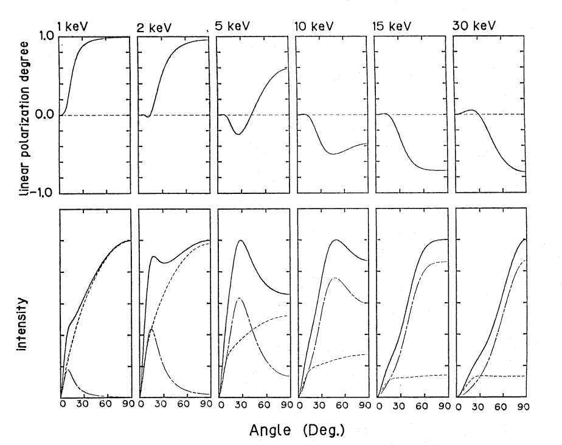
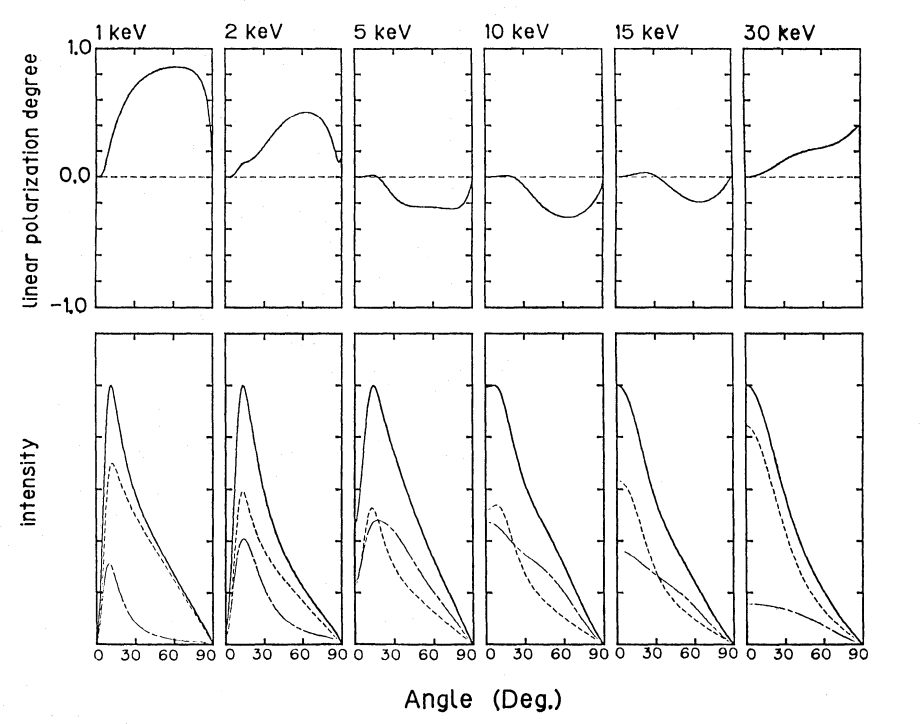

Here are some plots and data from http://adsabs.harvard.edu/abs/1987PASJ...39..781K

Figure 4a (data in [linear polarization](Fig4a-top.dat) and [total intensity](Fig4a-bottom-total.dat)):

Figure 4b (data in [linear polarization](Fig4b-top.dat) and [total intensity](Fig4b-bottom-total.dat)):
:

The X-ray intensity (lower panel) and the linear polarization degree &Pi;L (upper panel) calculated with Nagel's (1981) model for &tau;Th=80 and W=0 as functions of the angle between the magnetic field and the view direction.  Figure 4a shows the result for the cylinder column parallel to the magnitude with Ee=100 keV, whereas figure 4b shows the result for the slab of its surface perpendicular to the magneitc field with Ee=50 keV.  The dashed and dot-dashed lines in the intensities represnet the contributions of the ordinary and extraordinary modes, respectively.  The linear polarization degree is Q/I.
