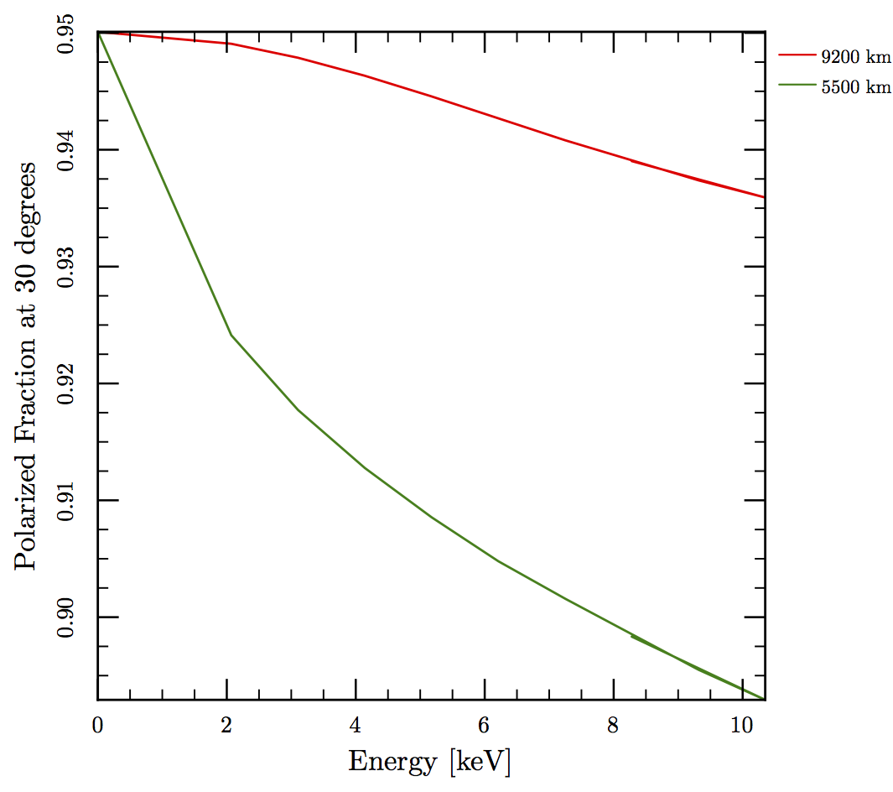

These are results for a white-dwarf star of 0.6 and 1 solar masses and radii given by the equation of state.  The magnetic dipole moment is 3 &times; 1034 G cm3. If we assume that the emission is coming from the surface we can derive constraints on the radius of the star.

The other plots look at how the model of the accretion column and emission pattern affects the observed polarization as a function of inclination and energy.
