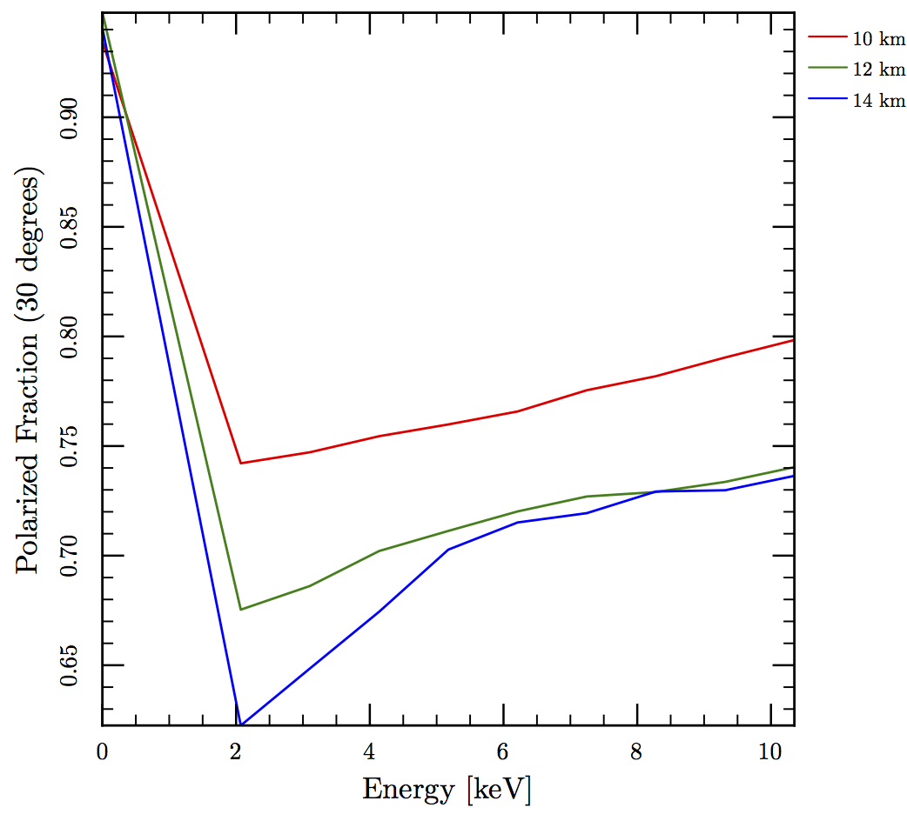

These are results for a neutron star of 1.4 solar masses and a canonical radius of 10 km.  The magnetic dipole moment is 1032 G cm3. If we assume that the emission is coming from the surface we can derive constraints on the radius of the star.

The other plots look at how the model of the accretion column and emission pattern affects the observed polarization as a function of inclination and energy.
