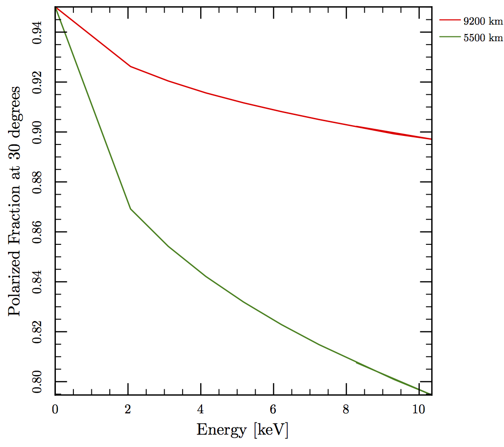
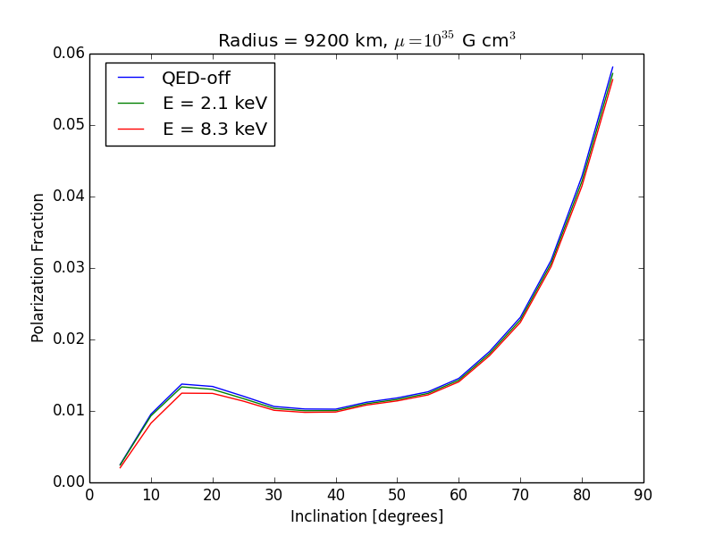
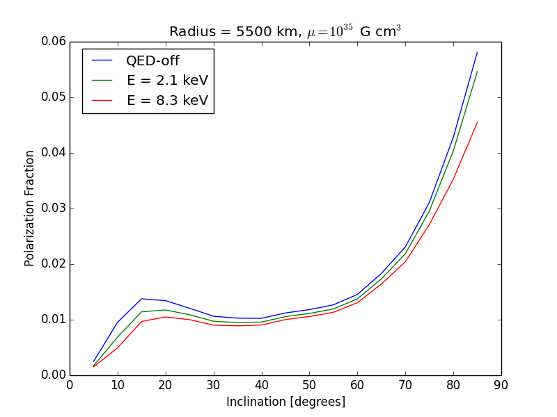

These are results for a white star of 0.6 and 1 solar masses and radii given by the equation of state.  The magnetic dipole moment is 1035 G cm3. If we assume that the emission is coming from the surface we can derive constraints on the radius of the star.

The other plots look at how the model of the accretion column and emission pattern affects the observed polarization as a function of inclination and energy.

The crucial difference between the QED case and the expectations of http://adsabs.harvard.edu/abs/2008MNRAS.386.2167M is that QED makes the polarization fraction a function of energy with the observed polarization decreasing with increasing energy.

The effect is more pronounced for smaller stars.
